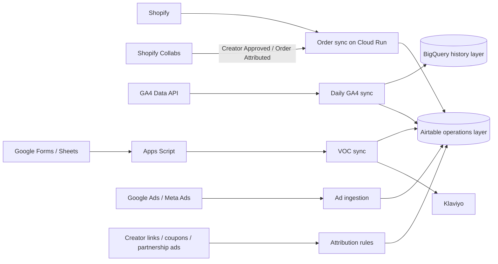

# Commerce Operations Data Hub: Shopify + GA4 + Airtable + Google Cloud

English | [简体中文](README.zh-CN.md)

A reusable commerce operations data hub that combines Shopify orders, GA4 behavior, ad and creator touchpoints, VOC surveys, and customer lifecycle data in Airtable, with Google Cloud providing secure ingestion and scheduled synchronization.

The repository contains reusable code, a sanitized data model, field dictionary, metric definitions, interface design, and runbooks. It deliberately excludes production records, tokens, URLs, project IDs, analytics property IDs, and Airtable internal IDs.

## Architecture

## What is included

- `services/shopify-order-sync`: full-order Shopify Flow ingestion, Shopify Collabs creator and attributed-order ingestion, optional Admin GraphQL, Airtable upsert, webhook and reconciliation.
- `services/ga4-airtable-sync`: daily T-4 GA4 extraction, BigQuery merge and Airtable upsert.
- `services/voc-survey-sync`: two-stage survey completion, eligible-order validation, Klaviyo events and lifecycle updates.
- `architecture`: data flow, data model, attribution rules and Airtable Interface design.
- `schema/airtable-schema.json`: complete sanitized metadata for 11 Airtable tables and 333 fields.
- `docs`: metric definitions, deployment, operations, privacy and Chinese data dictionary.

## Source-of-truth policy

- Shopify: orders, refunds and net revenue.
- GA4: on-site behavior and analytics-platform attribution.
- Ad platforms: spend and platform-reported conversions.
- Airtable: explainable touchpoints, creator relationships, campaign metadata, VOC stages and human review.
- Shopify Collabs: confirmed creator membership and creator-attributed order events. Shopify remains the financial source of truth for the order itself.

Differences among platforms are retained and reconciled rather than overwritten. A GA4/Shopify mismatch is not automatically treated as an order-sync defect.

## Current production scope

The production Cloud Run service currently accepts three Shopify Flow event types through the same private API Gateway endpoint:

- Standard Shopify order snapshots, upserted into `Orders` and linked to `Customers`.
- Shopify Collabs `Creator Approved` events, upserted into `Creators` with creator identity, country, coupon and available audience metadata.
- Shopify Collabs `Order Attributed` events, upserted into `Attribution Touchpoints` and linked to both the creator and Shopify order.

If a Collabs attribution event arrives before the matching order, the touchpoint is retained and the order link is repaired automatically after the order is synchronized. Shopify Flow only emits new events after activation, so historical Collabs creators and attributed orders require a one-time export and backfill.

The public repository contains the event handlers, sanitized Flow payload templates and automated tests. It does not contain the production gateway URL, API key, shared Flow token, customer records or creator records.

## Security

- Keep secrets in Google Secret Manager.
- Keep Cloud Run private and grant narrow invoker roles.
- Never commit production IDs, customer records or survey answers.
- Never send PII in GA4 event parameters or UTM values.
- Treat Airtable as an operations layer, not an unlimited warehouse.

See [the Chinese README](README.zh-CN.md) for the complete project guide.

## License

[MIT](LICENSE)
