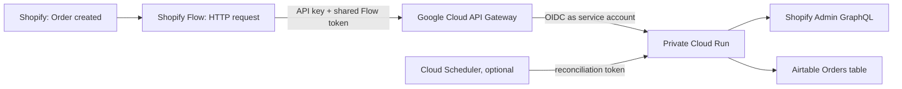

# Shopify Flow → Airtable on Google Cloud

[English](README.md) | [简体中文](README.zh-CN.md)

A reusable, security-conscious reference implementation for synchronizing Shopify orders to Airtable without Zapier or Make.

Shopify Flow sends only the order ID. A private Cloud Run service retrieves the canonical order from Shopify Admin GraphQL, maps it to Airtable, and performs an idempotent upsert by Shopify order ID.

## Architecture



The two request headers protect different layers:

- `x-api-key` lets API Gateway reject unknown callers before they reach the backend.
- `X-Shopify-Flow-Token` lets the application verify that the request came from the configured Flow.

Cloud Run stays private. API Gateway invokes it through a dedicated service account with only `roles/run.invoker` on that service.

## What this repository includes

- `main.py`: Flask service with Shopify Flow, signed webhook, health, and reconciliation endpoints.
- `gateway/openapi.template.yaml`: API Gateway configuration template.
- `tests/`: mapping, HMAC, Flow authentication, and order-ID retrieval tests.
- `docs/deployment.md`: end-to-end deployment guide.
- `docs/operations.md`: monitoring and incident runbook.

## Airtable schema

Create an Orders table with `Order ID` as the primary field. The service writes the following fields; Airtable `typecast` is enabled, but creating the appropriate field types first is recommended.

| Field | Recommended Airtable type |
|---|---|
| Order ID | Single line text, primary |
| Ordered At | Date with time |
| SKU | Single line text |
| Order Revenue | Currency/number |
| Discount Amount | Currency/number |
| Refund Amount | Currency/number |
| Net Revenue | Currency/number |
| Cancelled | Checkbox |
| Refunded | Checkbox |
| Country/Region | Single line text |
| Shopify Customer ID | Single line text |
| Customer Email | Email |
| Currency | Single line text |
| Payment Status | Single select or text |
| Fulfillment Status | Single select or text |
| Discount Codes | Long text |
| Line Items | Long text |
| SKU List | Long text |
| Order Source | Single line text |
| Main Product | Single line text |
| Landing Site | URL or long text |
| Referring Site | URL or long text |
| UTM Source / Medium / Campaign / Content / Term | Single line text |
| Click ID | Single line text |
| Last Synced At | Date with time |

You can rename fields in `order_to_airtable_fields()` to match an existing Airtable base.

## Shopify Flow configuration

Use the `Order created` trigger and a `Send HTTP request` action:

- Method: `POST`
- URL: `https://YOUR_GATEWAY_HOST/flow/shopify`
- Headers:
  - `Content-Type: application/json`
  - `x-api-key: YOUR_RESTRICTED_GATEWAY_KEY`
  - `X-Shopify-Flow-Token: YOUR_RANDOM_SHARED_TOKEN`
- Body:

```liquid
{"order_id": {{ order.id | json }}}
```

Only the order ID is sent by Flow. The backend fetches the full order, which keeps the Flow configuration small and avoids fragile field-by-field Liquid mappings.

## Runtime configuration

Non-secret environment variables:

```text
AIRTABLE_BASE_ID
AIRTABLE_ORDERS_TABLE
SHOPIFY_STORE_DOMAIN
SHOPIFY_API_VERSION
```

Secrets, preferably mounted from Google Secret Manager:

```text
AIRTABLE_TOKEN
SHOPIFY_ACCESS_TOKEN
SHOPIFY_FLOW_TOKEN
SHOPIFY_WEBHOOK_SECRET
RECONCILE_TOKEN
```

See [.env.example](.env.example) and [deployment instructions](docs/deployment.md).

## Endpoints

| Endpoint | Purpose | Authentication |
|---|---|---|
| `GET /health` | Health check | API Gateway key when exposed through the gateway |
| `POST /flow/shopify` | Shopify Flow ingestion | Gateway key + Flow token |
| `POST /webhooks/shopify` | Direct Shopify webhook ingestion | Shopify HMAC + allowed shop domain |
| `POST /reconcile` | Reload recently updated orders | Reconciliation token; expose only to trusted callers |

## Local development

```bash
python3 -m venv .venv
source .venv/bin/activate
pip install -r requirements-dev.txt
pytest -q
```

Run locally after providing environment variables:

```bash
flask --app main run --debug
```

## Operational behavior

- Upserts use Shopify `Order ID`, so retries do not create duplicate Airtable records.
- Flow requests with malformed IDs return `400` before any Airtable write.
- External Shopify or Airtable request failures return `502`.
- Unexpected application failures return `500` and are logged by Cloud Run.
- The optional reconciliation endpoint can repair missed updates within a configurable lookback window.

## Security notes

- Never commit API keys, personal access tokens, shared tokens, base IDs, table IDs, project IDs, store domains, or production URLs.
- Restrict the API key to the API Gateway managed service.
- Grant the gateway service account only `roles/run.invoker` on the target Cloud Run service.
- Keep Cloud Run unauthenticated access disabled.
- Store secrets in Secret Manager and rotate them when staff or vendors change.
- Treat customer email, location, order value, and line items as personal or commercially sensitive data.

## Limitations

- Shopify Flow handles new orders from the moment the workflow is enabled; it does not backfill historical orders.
- Historical backfills and reconciliation require Shopify Admin API access and the relevant order scopes.
- Airtable has API and record limits. For high-volume stores, use a queue and a database/warehouse instead of writing synchronously.
- Attribution fields are only as complete as Shopify's retained landing and referral data. They will not necessarily match GA4 or ad-platform attribution.

## License

[MIT](LICENSE)
