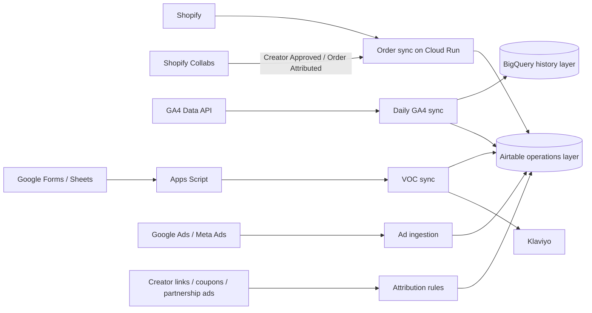

# Commerce Operations Data Hub: Shopify + GA4 + Google Sheets / Airtable + Google Cloud

English | [简体中文](README.zh-CN.md)

A reusable commerce operations data hub that combines Shopify orders, GA4 behavior, ad and creator touchpoints, VOC surveys, and customer lifecycle data in Airtable, with Google Cloud providing secure ingestion and scheduled synchronization.

The repository contains reusable code, a sanitized data model, field dictionary, metric definitions, interface design, and runbooks. It deliberately excludes production records, tokens, URLs, project IDs, analytics property IDs, and Airtable internal IDs.

## Google Sheets storage option

`services/sheets-record-store` is an IAM-protected record gateway. Set `SHEETS_STORE_URL` on the order/Collabs, VOC, and GA4 services to select Sheets; omission retains the legacy Airtable path. Import preserves record IDs and linked IDs without replaying survey emails. Airtable interfaces, relation chips, formulas, and rollups are not automatically recreated. Ad ingestion requires a separate connector handoff. See the [migration status and runbook](docs/google-sheets-migration.zh-CN.md); the architecture below also documents the original Airtable deployment.

## Dashboard summary on Google Sheets

The [private dashboard summary service and runbook](services/dashboard-summary/README.md) reads detail Sheets and writes a separate, contact-free summary workbook. As of 2026-09-17, deployment and one refresh/readback were verified. The daily **09:20 Asia/Shanghai** scheduler is enabled; the existing **09:00 T-4 GA4** job is unchanged. The first scheduled execution is still unverified. Looker Studio charts remain in progress; summary deployment is not completion of the dashboard.

## Architecture

## What is included

- `services/shopify-order-sync`: full-order Shopify Flow ingestion, Shopify Collabs creator and attributed-order ingestion, optional Admin GraphQL, Airtable upsert, webhook and reconciliation.
- `services/ga4-airtable-sync`: daily T-4 GA4 extraction, BigQuery merge and Airtable upsert.
- `services/voc-survey-sync`: two-stage survey completion, eligible-order validation, Shopify fallback recovery, Klaviyo events and lifecycle updates.
- `architecture`: data flow, data model, attribution rules and Airtable Interface design.
- `schema/airtable-schema.json`: complete sanitized metadata for 11 Airtable tables and 333 fields.
- `docs`: metric definitions, deployment, operations, privacy, VOC form copy and Chinese data dictionary.

## Source-of-truth policy

- Shopify: orders, refunds and net revenue.
- GA4: on-site behavior and analytics-platform attribution.
- Ad platforms: spend and platform-reported conversions.
- Airtable: explainable touchpoints, creator relationships, campaign metadata, VOC stages and human review.
- Shopify Collabs: confirmed creator membership and creator-attributed order events. Shopify remains the financial source of truth for the order itself.

Differences among platforms are retained and reconciled rather than overwritten. A GA4/Shopify mismatch is not automatically treated as an order-sync defect.

## Current production scope

The production Cloud Run service currently accepts three Shopify Flow event types through the same private API Gateway endpoint:

- Standard Shopify order snapshots, upserted into `Orders` and linked to `Customers`.
- Shopify Collabs `Creator Approved` events, upserted into `Creators` with creator identity, country, coupon and available audience metadata.
- Shopify Collabs `Order Attributed` events, upserted into `Attribution Touchpoints` and linked to both the creator and Shopify order.
- Future Shopify orders generate deterministic touchpoints from unique creator coupons, click IDs, UTM parameters and referrers. One final touchpoint owns order revenue; later Collabs confirmation takes precedence. Historical orders are not scanned by this path.

If a Collabs attribution event arrives before the matching order, the touchpoint is retained and the order link is repaired automatically after the order is synchronized. Shopify Flow only emits new events after activation, so historical Collabs creators and attributed orders require a one-time export and backfill.

VOC validation normally reads the Airtable order fact table. When a valid historical order is missing there, the VOC service can fall back to Shopify Admin GraphQL, upsert the missing customer and order snapshot, and then continue the lifecycle update. Failed Google Sheet rows can be retried on a six-hour Apps Script schedule with stable response IDs.

Survey forms should require the same email used on the qualifying order. A successful data write and an eligible-order match are separate states: `SYNCED + MATCHED` may continue to the warranty workflow, while `SYNCED + REVIEW_REQUIRED` is retained for manual review without emitting the benefit-completion event. See [VOC survey form copy and matching rules](docs/voc-survey-form-copy.md).

The public repository contains the event handlers, sanitized Flow payload templates and automated tests. It does not contain the production gateway URL, API key, shared Flow token, customer records or creator records.

## Security

- Keep secrets in Google Secret Manager.
- Keep Cloud Run private and grant narrow invoker roles.
- Never commit production IDs, customer records or survey answers.
- Never send PII in GA4 event parameters or UTM values.
- Treat Airtable as an operations layer, not an unlimited warehouse.

See [the Chinese README](README.zh-CN.md) for the complete project guide.

## License

[MIT](LICENSE)
