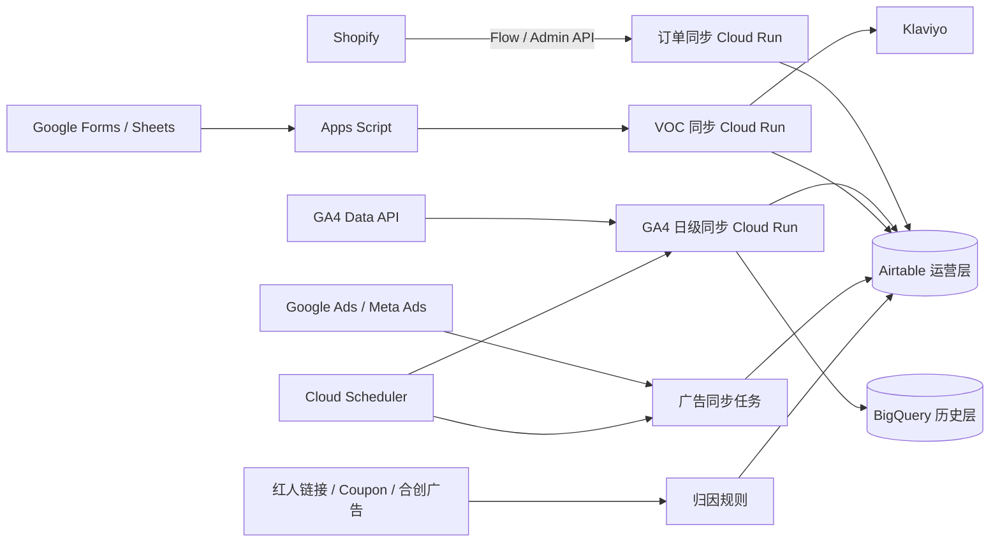

# 电商运营数据闭环：Shopify + GA4 + Airtable + Google Cloud

[English](README.md) | 简体中文

这是一个可复用的电商运营数据中台项目。它把 Shopify 订单、GA4 网站行为、广告与红人触点、VOC 调查和客户生命周期放进同一套 Airtable 数据模型，并由 Google Cloud 负责自动同步与定时任务。

公开仓库包含代码、数据结构、字段字典、指标口径、Interface 设计和运维方法；不包含真实客户记录、访问令牌、生产 URL、Google Cloud 项目 ID、GA4 Property ID 或 Airtable 内部 ID。

## 解决的问题

- Shopify 给出可靠订单和净收入，但不能完整解释站内浏览、未购漏斗和多触点归因。
- GA4 能观察行为和平台归因，但购买与收入不应替代 Shopify 财务口径。
- Google Ads、Meta Ads、红人链接、优惠码和合创广告需要统一归因结构。
- 问卷完成、延保审核和客户生命周期需要与订单关联，而不是留在孤立表格里。
- Airtable 负责业务协作和人工审核；BigQuery 保留可扩展的日级历史数据。

## 总体架构



## 仓库结构

```text
services/
  shopify-order-sync/   Shopify 订单查询、映射、幂等写入与对账
  ga4-airtable-sync/    每日读取 T-4 GA4 数据，写入 BigQuery 与 Airtable
  voc-survey-sync/      两阶段问卷、订单资格校验、Klaviyo 事件和生命周期回写
architecture/
  data-flow.md          数据流和系统边界
  data-model.md         11 张 Airtable 表的关系
  attribution-rules.md  广告、红人、Coupon、UTM 和平台归因规则
  airtable-interface.md Interface 页面和业务用途
schema/
  airtable-schema.json  去除生产 ID 后的完整 Airtable 元数据
docs/
  data-dictionary.zh-CN.md  333 个字段的数据字典
  metric-definitions.md     核心指标与平台差异
  google-cloud-deployment.md 部署方式
  operations-runbook.md      日常运行、补数和故障处理
  security-privacy.md        安全与隐私边界
  implementation-status.md  已实现、已建模和待接平台的边界
```

## Airtable 数据模型

| 表 | 角色 |
|---|---|
| 客户 | 客户主数据与跨订单身份 |
| 订单 | Shopify 订单事实表和财务口径 |
| 红人 | 红人主数据，包括平台代理或供应商合作 |
| 内容资产 | 内容、链接、UTM、Coupon 与素材表现 |
| 归因触点 | 一次客户或订单对应的可解释触点 |
| 客户生命周期 | 问卷阶段、延保审核和客户运营状态 |
| 红人合作 | 合作批次、费用、交付和结算 |
| 广告系列 | 跨账户 Campaign 主数据 |
| 广告 | 广告、创意、合创广告与红人关联 |
| 广告每日表现 | 平台日级消耗、曝光、点击和归因结果 |
| GA4运营与用户行为 | 站内行为、漏斗人群、Shopify 对账和页面表现 |

完整字段见 [Airtable 数据字典](docs/data-dictionary.zh-CN.md) 和 [机器可读 Schema](schema/airtable-schema.json)。

## 三类已实现同步

### 1. Shopify 订单

- Shopify Flow 仅发送订单 ID。
- 私有 Cloud Run 使用 Shopify Admin GraphQL 拉取完整订单。
- 以订单 ID 幂等写入 Airtable。
- 支持原生 Webhook、Flow 和指定时间范围对账。
- 订单、退款、折扣、取消状态和净收入以 Shopify 为准。

### 2. GA4 日级数据

- 每天只拉取 T-4，避开 GA4 约三天的数据成熟延迟。
- 写入 BigQuery 分区表，并同步 Airtable 的“全站日级”记录。
- 包含用户、会话、互动、浏览、购买用户、购买事件和 GA4 购买收入。
- GA4 购买或收入与 Shopify 不一致时，按平台口径差异处理并对账。

### 3. 两阶段 VOC

- Google Form 响应进入 Google Sheet 后，由 Apps Script 调用私有 Cloud Run。
- 服务按邮箱查找符合条件、未取消的产品订单。
- 成功后向 Klaviyo 发出阶段完成事件，并更新 Airtable 客户生命周期。
- 延保或奖励只写“待审核”状态，由售后人工确认，不由自动化直接生效。

## 数据口径

| 问题 | 主口径 |
|---|---|
| 有多少真实订单、净收入、退款 | Shopify |
| 用户看了什么、停留多久、漏斗如何 | GA4 |
| 广告平台自报消耗和转化 | 对应广告平台 |
| 红人链接、Coupon、合创广告关系 | Airtable 归因触点 + 订单证据 |
| 问卷阶段与延保审核 | Airtable 客户生命周期 |

同一笔业务在不同平台出现不同数字是常见情况。仓库不会强行把 GA4 或广告平台改成 Shopify，而是保留来源、口径和差值，方便对账。

## 快速开始

每个服务独立部署，进入对应目录安装依赖并运行测试：

```bash
cd services/shopify-order-sync
python3 -m venv .venv
source .venv/bin/activate
pip install -r requirements-dev.txt
pytest -q
```

GA4 和 VOC 服务的环境变量见各自目录下的 `.env.example`。完整部署见 [Google Cloud 部署说明](docs/google-cloud-deployment.md)。

## 安全边界

- 所有 Token 和 API Secret 存入 Secret Manager。
- Cloud Run 默认私有，调用方仅授予 `roles/run.invoker`。
- Git 中不提交生产 ID、生产 URL、客户邮箱、订单记录或问卷回答。
- GA4 事件和 UTM 不应包含邮箱、手机号等 PII。
- Airtable 是运营协作层，不建议作为无限增长的数据仓库。

## 开源许可

[MIT](LICENSE)
