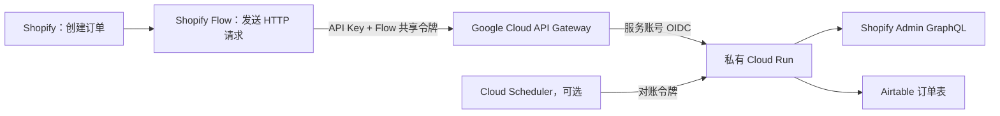

# 基于 Google Cloud 的 Shopify Flow → Airtable 订单同步

[English](README.md) | [简体中文](README.zh-CN.md)

这是一套可复用的 Shopify 订单同步方案，不依赖 Zapier 或 Make，通过 Google Cloud 将 Shopify 订单安全地写入 Airtable。

Shopify Flow 只发送订单 ID。部署在私有 Cloud Run 上的服务会通过 Shopify Admin GraphQL 获取完整订单，转换成 Airtable 字段，并以 Shopify 订单 ID 为唯一键执行新增或更新。重复请求不会故意生成重复订单。

## 系统架构



请求中的两个鉴权头分别保护不同层级：

- `x-api-key`：由 API Gateway 校验，在请求到达后端前拦截未知调用方。
- `X-Shopify-Flow-Token`：由应用服务校验，确认请求来自已配置的 Shopify Flow。

Cloud Run 保持私有，不开放匿名访问。API Gateway 使用独立服务账号调用 Cloud Run，该账号只拥有目标服务的 `roles/run.invoker` 权限。

## 仓库内容

- `main.py`：Flask 同步服务，包含 Shopify Flow、签名 Webhook、健康检查和订单对账接口。
- `gateway/openapi.template.yaml`：API Gateway 配置模板。
- `tests/`：订单字段转换、HMAC、Flow 鉴权和订单 ID 查询测试。
- `docs/deployment.md`：从零部署到 Google Cloud 的完整说明。
- `docs/operations.md`：上线检查、故障排查和密钥轮换手册。

## Airtable 表结构

新建一张订单表，将 `Order ID` 设置为主字段。服务会写入以下字段。代码启用了 Airtable `typecast`，但仍建议提前按正确类型创建字段。

| 字段 | 建议的 Airtable 类型 |
|---|---|
| Order ID | 单行文本，主字段 |
| Ordered At | 日期和时间 |
| SKU | 单行文本 |
| Order Revenue | 货币或数字 |
| Discount Amount | 货币或数字 |
| Refund Amount | 货币或数字 |
| Net Revenue | 货币或数字 |
| Cancelled | 复选框 |
| Refunded | 复选框 |
| Country/Region | 单行文本 |
| Shopify Customer ID | 单行文本 |
| Customer Email | 邮箱 |
| Currency | 单行文本 |
| Payment Status | 单选或文本 |
| Fulfillment Status | 单选或文本 |
| Discount Codes | 多行文本 |
| Line Items | 多行文本 |
| SKU List | 多行文本 |
| Order Source | 单行文本 |
| Main Product | 单行文本 |
| Landing Site | URL 或多行文本 |
| Referring Site | URL 或多行文本 |
| UTM Source / Medium / Campaign / Content / Term | 单行文本 |
| Click ID | 单行文本 |
| Last Synced At | 日期和时间 |

如果现有 Airtable 使用其他字段名称，可以在 `order_to_airtable_fields()` 中调整映射。

## Shopify Flow 配置

触发器选择 `Order created`，然后添加 `Send HTTP request` 动作：

- 请求方法：`POST`
- URL：`https://YOUR_GATEWAY_HOST/flow/shopify`
- 请求头：
  - `Content-Type: application/json`
  - `x-api-key: YOUR_RESTRICTED_GATEWAY_KEY`
  - `X-Shopify-Flow-Token: YOUR_RANDOM_SHARED_TOKEN`
- 请求正文：

```liquid
{"order_id": {{ order.id | json }}}
```

Flow 只需要传递订单 ID。后端会再向 Shopify 获取规范的完整订单，因此不需要在 Flow 中维护容易出错的逐字段 Liquid 映射。

## 运行参数

普通环境变量：

```text
AIRTABLE_BASE_ID
AIRTABLE_ORDERS_TABLE
SHOPIFY_STORE_DOMAIN
SHOPIFY_API_VERSION
```

建议从 Google Secret Manager 挂载的敏感参数：

```text
AIRTABLE_TOKEN
SHOPIFY_ACCESS_TOKEN
SHOPIFY_FLOW_TOKEN
SHOPIFY_WEBHOOK_SECRET
RECONCILE_TOKEN
```

参数示例见 [.env.example](.env.example)，完整步骤见 [部署说明](docs/deployment.md)。

## 接口说明

| 接口 | 用途 | 鉴权方式 |
|---|---|---|
| `GET /health` | 服务健康检查 | 通过网关访问时需要 API Key |
| `POST /flow/shopify` | 接收 Shopify Flow 订单 | API Key + Flow Token |
| `POST /webhooks/shopify` | 接收 Shopify 原生 Webhook | Shopify HMAC + 店铺域名校验 |
| `POST /reconcile` | 重新同步近期更新订单 | 对账令牌，只应开放给可信调用方 |

## 本地开发

```bash
python3 -m venv .venv
source .venv/bin/activate
pip install -r requirements-dev.txt
pytest -q
```

配置好环境变量后，可在本地启动服务：

```bash
flask --app main run --debug
```

## 运行机制

- 以 Shopify `Order ID` 执行新增或更新，重试不会故意生成重复记录。
- Flow 传入不合法订单 ID 时，会在写入 Airtable 前返回 `400`。
- Shopify 或 Airtable 请求失败时返回 `502`。
- 应用内部发生意外错误时返回 `500`，并写入 Cloud Run 日志。
- 可选的订单对账接口能够重新同步指定时间范围内的订单，修复遗漏更新。

## 安全要求

- 不要将 API Key、访问令牌、共享令牌、Base ID、Table ID、Google Cloud 项目 ID、店铺域名或生产 URL 提交到 Git。
- API Key 应限制为只能访问对应的 API Gateway 托管服务。
- API Gateway 服务账号只授予目标 Cloud Run 的 `roles/run.invoker` 权限。
- Cloud Run 不应开启匿名访问。
- 敏感信息应放在 Secret Manager 中；人员或供应商发生变化时及时轮换。
- 客户邮箱、地区、订单金额和商品明细属于个人信息或商业敏感数据，应控制访问权限。

## 已知限制

- Shopify Flow 只处理工作流启用后的新订单，不会自动补齐历史订单。
- 历史回填和订单对账需要 Shopify Admin API 权限及相应订单 Scope。
- Airtable 存在 API 速率和记录数量限制。订单量较大时，应通过消息队列和数据库或数据仓库解耦，不建议同步直写 Airtable。
- 归因字段取决于 Shopify 实际保留的落地页和引荐数据，不一定与 GA4 或广告平台的归因结果一致。

## 开源许可

[MIT](LICENSE)
