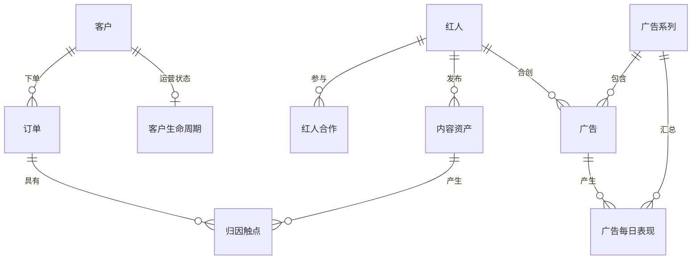

# Airtable 数据模型

## 建模原则

- 客户和红人是主数据；订单、触点、日级广告表现、GA4 日级行为是事实数据。
- Campaign/Ad 使用“平台 + Account ID + 平台对象 ID”组成稳定键，避免两个广告账户重号。
- 合创广告必须同时保留 Ad ID、Creator、供应商和合作来源，即使红人不在原始 Google Sheet 或 Shopify Collabs 中。
- 归因触点允许一笔订单对应多个触点，并保存角色：首次发现、助攻、最后点击、Coupon、人工确认。
- `schema/airtable-schema.json` 是机器可读结构；`docs/data-dictionary.zh-CN.md` 是管理层可读字典。
